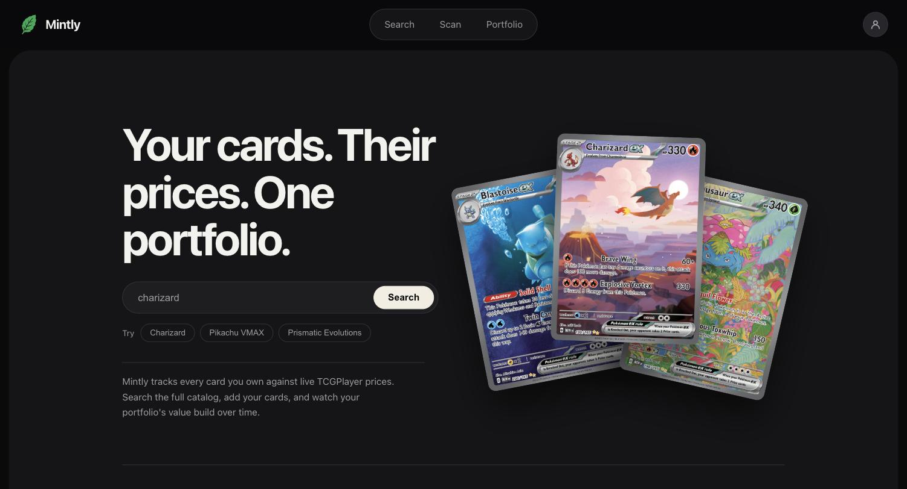
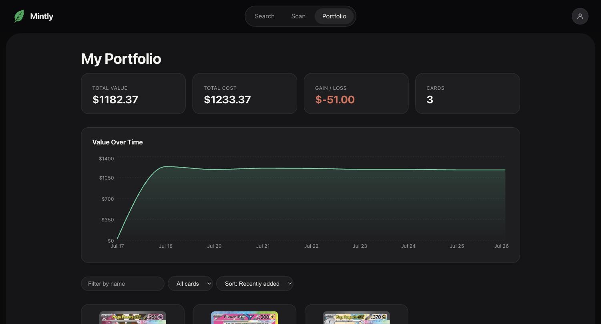
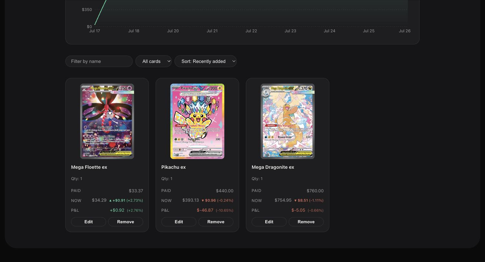
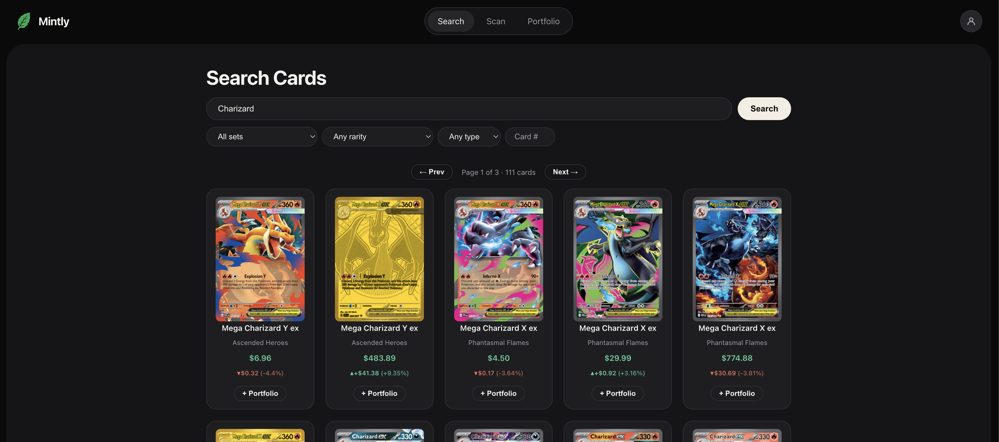
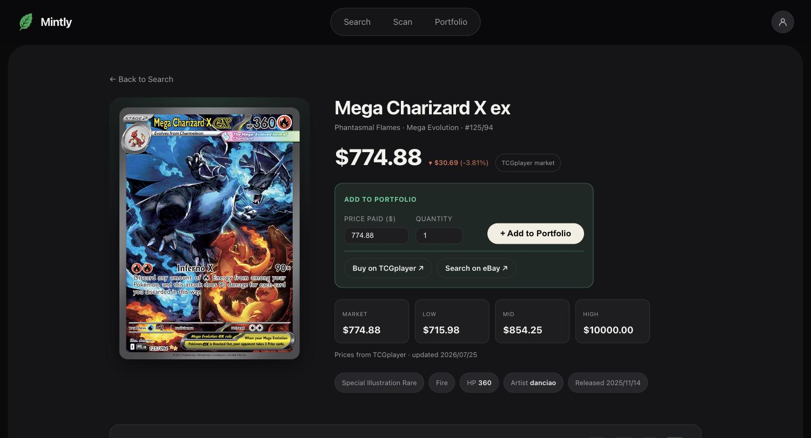
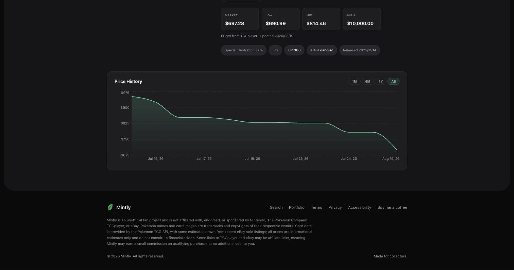

# Mintly

[](https://mintlytcg.com)


**Live at [mintlytcg.com](https://mintlytcg.com).** A Pokemon TCG portfolio tracker: search cards, scan them with your camera, monitor live market prices, watch cards for price alerts, and track your collection's value over time.



## Stack

- **Backend** — FastAPI, PostgreSQL, SQLAlchemy, Alembic migrations, JWT auth
- **Frontend** — React 19, TypeScript, Vite, React Router, Recharts
- **Production** — Docker Compose (Postgres + API + Caddy) behind a Cloudflare Tunnel

## Features

- **Smart search** — natural-language queries ("charizard 4 base set") parsed into name/number/set filters, with set-name recognition, word-drop fallback, and debounced search-as-you-type
- **Camera card scanner** — point your phone at a card and Mintly finds it by matching the _artwork_, not the text: a self-hosted CLIP image-embedding model (ViT-B/32) fingerprints every catalog card once, and each scan embeds the photo (plus its mirror) and returns the nearest cards to confirm and add. Robust to glare/blur/angle where OCR isn't, runs entirely on Mintly's own hardware, so it's **free and unlimited** with no per-scan cost. The photo is used only to compute the match and is never stored; the scanner also measures its own accuracy with anonymous, no-user-id feedback logged on each confirmed pick or miss (which candidate, at what rank and match score).
- **Catalog-first browsing** — a daily crawl mirrors the full card catalog (~20k cards) into Postgres, so search/browse answer in milliseconds and keep working through upstream API outages; dead upstream image URLs are auto-repaired against TCGplayer product scans
- **Card varieties as first-class cards** — stamped/marked TCGplayer siblings of a card (`[Staff]`, `[W Stamped]`, `(Black Dot Error)`) are forked into their own synthetic catalog entries — searchable, browsable, holdable, and charted like any card — with a "Variety" badge and an "Other versions" section cross-linking a card and its siblings (finishes like holo/reverse stay on the base card as variants)
- **Three price sources in accuracy order** — TCGPlayer prices via the Pokemon TCG API; real TCGplayer prices from [TCGCSV](https://tcgcsv.com) for brand-new sets the API hasn't priced yet (variant-accurate, so a 5¢ common shows as 5¢); eBay sold-listings median as the last resort, so even unpriced cards show an estimate
- **Price history charts** (1M/6M/1Y/All) built from Mintly's own daily snapshots — no upstream history API exists — with one colored line per variant on multi-variant cards and daily price-change chips wherever a price appears
- **Portfolio tracking by purchase lot** — per-lot gain/loss, daily change, filters and sorting, and a value-over-time chart; each purchase is its own lot, and lots group into holdings by card + grade
- **Multiple named portfolios** — keep several collections at once (an always-present default plus any you create), switch the active one, target adds per-card or per-scan-batch with a picker, and export or import each portfolio as CSV
- **Condition & graded slabs** — every lot carries a condition (raw grades like Near Mint) or a slab (PSA/BGS/CGC/SGC/Other + grade); raw and graded copies of a card tile separately, and a graded holding renders inside a slab and is valued at cost until a graded price source lands (phase 2)
- **Master set completion** — for every set you own a card in, a progress readout toward the full master set (secret rares included), sorted nearest-to-complete first
- **Price watchlist with email alerts** — track cards you don't own, set a target price (above or below), and get a daily email when a watched card crosses it — edge-triggered with a re-arm latch, so a card sitting past its target isn't re-alerted every day
- **Social sign-in** — one-click Google sign-in (OAuth/OIDC) alongside email + password, merging by verified email; Microsoft support is built in and offered automatically once its credentials are configured
- **Full account lifecycle** — JWT auth, profile editing (email/username/password), soft email verification, password reset by email (single-use, hashed, 30-minute tokens), sign-out-everywhere, and self-service account deletion
- **Accessibility preferences** — reduce motion, high contrast, underlined links, and text size; applied instantly and stored per device
- **Hardened public API** — per-IP sliding-window rate limits sized for humans, an uptime `/health` probe, and anti-enumeration password-reset responses
- **SEO-ready** — JSON-LD structured data, robots.txt, and a catalog-driven sitemap covering every card page
- **Self-funding, ad-free** — optional "Buy on TCGplayer" / "Search on eBay" affiliate links on each card and a "Buy me a coffee" link, all config-gated (no ads, no subscriptions, no tracking)
- **Tiered history storage** — recent dailies in Postgres, older months compacted to monthly closes with the full dailies archived to gzipped CSV (offloaded, never deleted)

## Screenshots

**Portfolio** — summary tiles, a value-over-time chart, and per-lot holdings with daily change:





**Search** — natural-language search with set/rarity/type filters and daily price-change chips:



**Card detail** — live prices, market/low/mid/high spread, quick add-to-portfolio, and buy links:



**Price history** — built from Mintly's own daily snapshots, with 1M/6M/1Y/All ranges:



## Getting Started

### Backend

1. Install dependencies:

   ```bash
   cd Backend
   python -m venv venv
   source venv/bin/activate
   pip install -r requirements.txt
   ```

2. Create a `.env` file:

   ```
   DATABASE_URL=postgresql://username@localhost:5432/mintly
   SECRET_KEY=your-secret-key
   POKEMON_TCG_API_KEY=your-api-key

   # Optional — outbound email (password reset, email verification, watchlist alerts).
   # Unset SMTP_HOST = links and alerts print to the server console instead of sending (the right dev mode).
   FRONTEND_BASE_URL=http://localhost:5173
   SMTP_HOST=smtp.resend.com
   SMTP_USER=resend
   SMTP_PASSWORD=your-resend-api-key
   MAIL_FROM="Mintly <noreply@example.com>"

   # Optional — social sign-in (each provider is offered only when both its id and secret are set).
   GOOGLE_OAUTH_CLIENT_ID=...
   GOOGLE_OAUTH_CLIENT_SECRET=...
   OAUTH_CALLBACK_BASE=http://localhost:8000
   ```

3. Create the database and apply migrations:

   ```bash
   psql postgres -c "CREATE DATABASE mintly;"
   alembic upgrade head
   ```

4. Start the server:

   ```bash
   uvicorn app.main:app --reload
   ```

   API runs at `http://localhost:8000`. Interactive docs at `http://localhost:8000/docs`.

   > `requirements.txt` includes the camera scanner's ML stack (CPU PyTorch + `sentence-transformers`); it's a heavy install and the CLIP model downloads and caches on first use. `/scan` returns matches only after the card artwork has been fingerprinted — run `venv/bin/python scripts/embed_catalog.py` once to backfill `card_catalog.embedding`, then restart the API (it caches the embedding matrix, with a 6h TTL).

### Frontend

1. Install dependencies:

   ```bash
   cd Frontend/mintly
   npm install
   ```

2. Start the dev server:

   ```bash
   npm run dev
   ```

   App runs at `http://localhost:5173`.

## Production & deploying

The live site is **https://mintlytcg.com** — Docker Compose on a home server (`pikachuserver`): Caddy serves the built frontend and proxies `/api/*` to the FastAPI container, behind a Cloudflare Tunnel (HTTPS terminates at Cloudflare's edge; no ports are opened at home). Full architecture: HANDOFF.md "Production deployment".

To deploy a new commit:

```bash
git push                       # from the dev machine

ssh pika                       # then, on the server:
cd ~/apps/mintly
git pull
cd Frontend/mintly && npm ci && npm run build && cd ../..   # if frontend files changed
docker compose up -d --build                                # if backend files changed
docker compose restart caddy                                # if the Caddyfile changed
```

- **Frontend-only change** → just the npm build; Caddy serves the `dist/` bind mount, so the new build is live immediately, no restart.
- **Backend change** → `docker compose up -d --build` rebuilds the api image and restarts the container.
- **Caddyfile change** → needs the explicit `restart caddy`: the file is bind-mounted, so compose won't recreate the container on its own.
- **DB schema change** → also run `docker compose exec api alembic upgrade head` once the new image is up.
- **Card scanner** → the api image bundles CPU PyTorch + the baked CLIP model, so the first `--build` is slow and pulls a large image. After the `card_catalog.embedding` column exists, run `docker compose exec -T api python scripts/embed_catalog.py` once to fingerprint every card image, then `docker compose restart api` so it loads the fresh embeddings — `/scan` returns nothing until this completes. A weekly cron re-runs the backfill so newly-crawled cards get embedded.

Verify after any deploy: `curl https://mintlytcg.com/api/health` → `{"status":"ok"}`.

## Price history & the daily snapshot job

Mintly builds its own price history — there is no upstream history API. One row per card per UTC day lands in `card_price_snapshot`, written by `Backend/scripts/snapshot_all.py`, which runs in four phases:

1. **TCGPlayer crawl** — pages the full card list (~20.5k cards) and snapshots every priced card. Flaky pages are retried inline, then again in an end-of-run second pass; a page has to fail both to be skipped.
2. **TCGCSV fill** — cards with no TCGPlayer price (~1.6k: brand-new sets plus old oddballs) get real TCGplayer prices from the TCGCSV mirror, matched by set + card number and stored in the catalog like any other price — so newest-set cards browse as normally-priced cards, variant table and all.
3. **eBay fill** — whatever TCGCSV couldn't match gets the median of its recent eBay _sold_ listings instead, newest sets first, paced 3s between scrapes. Cards with too few recent sales record nothing; only 5 consecutive failed fetches (bot block) stop the pass early.
4. **Compaction to cold storage** — see the next section.

The crawl also does two catalog-maintenance passes: **image repair** HEAD-checks each card's artwork URL and re-points dead ones (`images.pokemontcg.io` answers a missing image with a card-back PNG under a 404) at the TCGplayer product scan, and **variety forking** splits any stamped/marked TCGplayer sibling of a card (`[Staff]`, `[W Stamped]`, black-dot errors) into its own synthetic catalog entry. The card scanner's image embeddings are _not_ touched here — new cards are fingerprinted separately by `scripts/embed_catalog.py`.

```bash
cd Backend
venv/bin/python scripts/snapshot_all.py                       # full run by hand (crawl ~30min; the eBay tail depends on what TCGCSV leaves over)
venv/bin/python scripts/snapshot_all.py --max-pages 2 --max-ebay 0 --no-tcgcsv   # quick smoke test
# flags: --max-pages N     stop the crawl after N pages (0 = all)
#        --no-tcgcsv       skip the TCGCSV price fill
#        --max-ebay N      cap eBay estimates (default 500; 0 = skip)
#        --ebay-pause S    seconds between eBay scrapes (default 3)
#        --no-compact      skip the cold-storage step
```

In production it's scheduled by cron on the server at **20:00 UTC** — right at TCGCSV's daily 20:00 UTC refresh, and the crawl's first ~30 minutes of paging run before the TCGCSV fill reads anything, so the fill sees same-day prices. It runs inside the api container and logs to `~/logs/mintly-snapshot.log`:

```bash
# on the server, from ~/apps/mintly (compose commands need the compose file's directory)
docker compose exec -T api python scripts/snapshot_all.py   # the command cron runs (flags above work here too)
tail -f ~/logs/mintly-snapshot.log                          # watch a run / read the last summary
docker compose top api                                      # a "python scripts/snapshot_all.py" line = crawl in progress
journalctl -u cron --since today | grep -i mintly           # confirm cron fired it
crontab -l                                                  # the schedule (snapshot + nightly backup + rotation)
```

A healthy run ends with a summary block (pages ok, cards priced, tcgcsv/ebay fill counts, snapshots written). The occasional dropped page is routine upstream flakiness — its cards are recovered from TCGCSV the same run, and anything missed is caught the next day. A dev machine can run the same script directly against its local DB: `cd Backend && venv/bin/python scripts/snapshot_all.py`.

### Tiered history storage (stock-chart style)

Left alone, daily snapshots would grow the database ~1.1GB/year forever. Instead, history is tiered like stock-market data — and old data is **offloaded, never deleted**:

- **Last ~30 days** — full daily rows in Postgres (charts' 1M range stays daily-resolution).
- **Older months** — the DB keeps one row per card per month (its month-end "close"), so 6M/1Y/All chart ranges show monthly points. Keeps the DB to ~36MB/year.
- **The full old dailies** — exported to `Backend/.archive/price-history/YYYY-MM.csv.gz` (~3–6MB/month, gitignored) _before_ the DB copy is thinned; the archive file must exist on disk before a single row is removed. Back this folder up — the DB alone no longer holds full history.

The snapshot job compacts automatically each day (a month becomes eligible once it's complete and 30+ days old). Manual controls:

```bash
cd Backend
venv/bin/python scripts/archive_history.py                    # compact eligible months now
venv/bin/python scripts/archive_history.py --list             # what's archived, with sizes
venv/bin/python scripts/archive_history.py --restore 2026-05  # load a month's dailies back into the DB
```

## Testing

Backend tests run offline (in-memory SQLite + fake upstream APIs — no network, no Postgres needed):

```bash
cd Backend
venv/bin/pip install -r requirements-dev.txt
venv/bin/pytest tests/ -q     # 410 tests, ~30s
```

## API Endpoints

| Method | Endpoint                         | Description                                                                                       |
| ------ | -------------------------------- | ------------------------------------------------------------------------------------------------- |
| POST   | `/auth/register`                 | Create account                                                                                    |
| POST   | `/auth/login`                    | Login, returns JWT                                                                                |
| GET    | `/auth/oauth/providers`          | Social sign-in providers with credentials configured (`google`/`microsoft`)                       |
| GET    | `/search?q=`                     | Natural language card search                                                                      |
| GET    | `/cards?name=&set_id=&number=`   | Filtered card search                                                                              |
| GET    | `/cards/{card_id}`               | Get a single card                                                                                 |
| GET    | `/cards/{card_id}/history?days=` | Daily price points from Mintly's snapshots                                                        |
| GET    | `/cards/{card_id}/ebay-price`    | Recent eBay sold-listings estimate                                                                |
| POST   | `/scan`                          | Camera scanner: upload a card photo, get the nearest catalog cards by image match (auth required) |
| POST   | `/scan/feedback`                 | Anonymous scanner-accuracy telemetry (no user id; auth-gated)                                      |
| GET    | `/sets`                          | List all sets                                                                                     |
| GET    | `/sets/{set_id}/cards`           | Cards in a set                                                                                    |
| GET    | `/portfolios`                    | List your named portfolios (auth required)                                                         |
| POST   | `/portfolios`                    | Create a named portfolio (auth required)                                                           |
| PATCH  | `/portfolios/{id}`               | Rename a portfolio (auth required)                                                                 |
| DELETE | `/portfolios/{id}`               | Delete a portfolio and its lots; the last one can't be deleted (auth required)                     |
| GET    | `/portfolio`                     | Get your portfolio; optional `?portfolio_id=` scope, omitted = all portfolios (auth required)      |
| GET    | `/portfolio/history`             | Portfolio value over time (auth required)                                                          |
| GET    | `/portfolio/set-completion`      | Per-set master-set completion for sets you own cards in (auth required)                            |
| POST   | `/portfolio/add`                 | Add a card to a portfolio (auth required)                                                          |
| POST   | `/portfolio/add-batch`           | Bulk add lots, e.g. a CSV import (auth required)                                                   |
| PATCH  | `/portfolio/{id}`                | Edit a lot's price/quantity/grade (auth required)                                                  |
| DELETE | `/portfolio/{id}`                | Remove a lot from a portfolio (auth required)                                                      |
| GET    | `/watchlist`                     | Cards you're watching, priced with the daily-change pipeline (auth required)                       |
| POST   | `/watchlist`                     | Watch a card, optionally with a target price + direction (auth required)                           |
| PATCH  | `/watchlist/{id}`                | Update a watched card's alert target/direction (auth required)                                     |
| DELETE | `/watchlist/{id}`                | Stop watching a card (auth required)                                                               |
| GET    | `/health`                        | Uptime probe: 200 when app + DB answer, 503 otherwise                                             |
| GET    | `/sitemap.xml`                   | XML sitemap for crawlers (static pages + every catalog card)                                      |

Social sign-in (`GET /auth/oauth/{provider}/start` → provider → `GET /auth/oauth/{provider}/callback`), email verification (`POST /auth/verify-email/send`, `POST /auth/verify-email`), password reset (`POST /auth/forgot-password`, `POST /auth/reset-password`), profile management (`GET`/`PATCH /auth/me`, `POST /auth/me/password`, `POST /auth/me/sign-out-others`), and account deletion (`DELETE /auth/me`) round out the auth surface — see HANDOFF.md for the full endpoint reference.

## Disclaimer

Mintly is an unofficial fan project, not affiliated with, endorsed, or sponsored by Nintendo, The Pokémon Company, TCGplayer, or eBay. Pokémon and all card images are trademarks of their respective owners. Prices shown are third-party market figures and estimates, provided for informational purposes only — not offers to buy or sell. Some links to TCGplayer and eBay may be affiliate links, meaning Mintly may earn a small commission on qualifying purchases at no additional cost to you.
